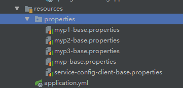
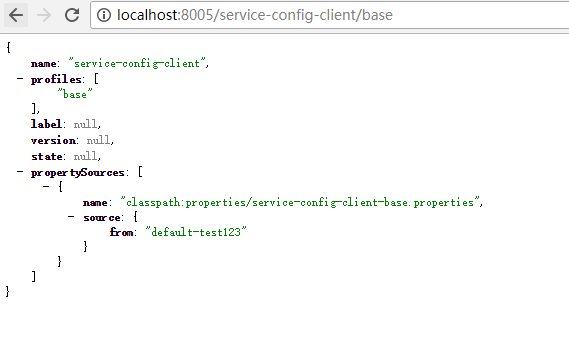
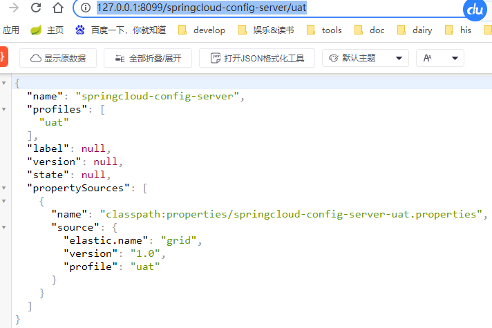
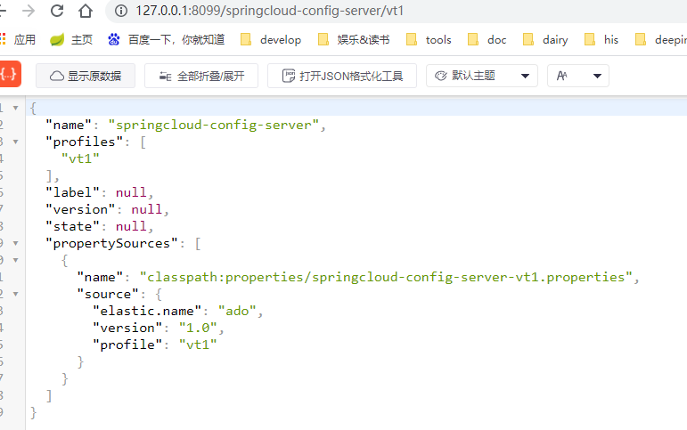
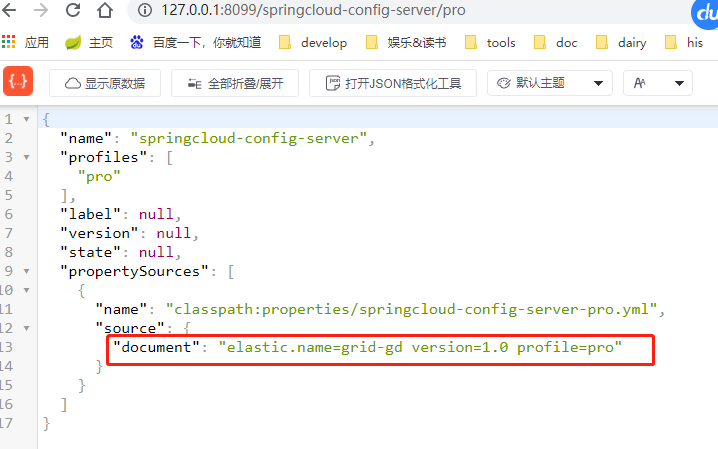

# application.yml文件的配置

```
server:
  port: 8005


eureka:
  client:
    serviceUrl:
      defaultZone: http://localhost:8001/eureka/
  instance:
    prefer-ip-address: true
    instance-id: ${spring.cloud.client.ipAddress}:${server.port}

spring:
  cloud:
    config:
      server:
        native:
          search-locations: classpath:properties/ # 搜索src/main/resource 下的properties文件夹下的文件
  application:
    name: service-config
  profiles:
    active: native  # 配置使用本地储存

```


注意：这里properties下的文件命名格式为 客户端的spring.application.name 加上profile后缀

URL与配置文件的映射关系如下：

```
/{application}/{profile}[/{label}]
/{application}-{profile}.yml
/{label}/{application}-{profile}.yml
/{application}-{profile}.properties
/{label}/{application}-{profile}.properties
/{label}/{application}-{profile}.yml
```

service-config-client-base中的配置:
from=default-test123

启动后可以通过url按照上面的映射方式访问到对应的properties:


1. 实际访问
   
   
2. yml格式的配置文件
   
