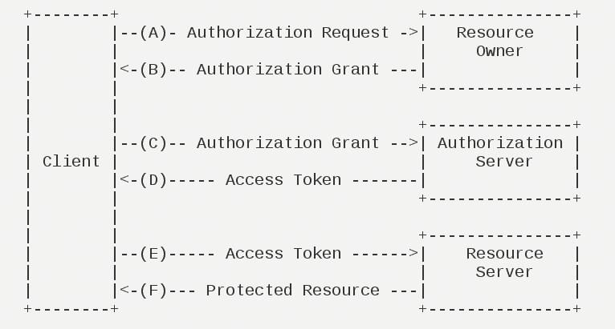
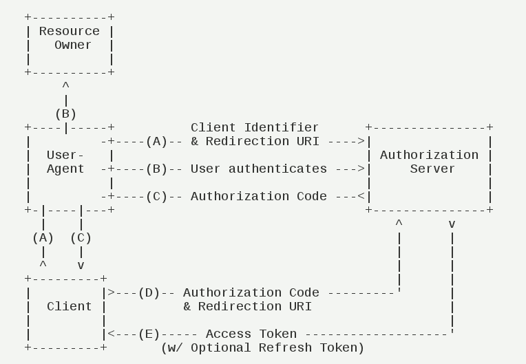
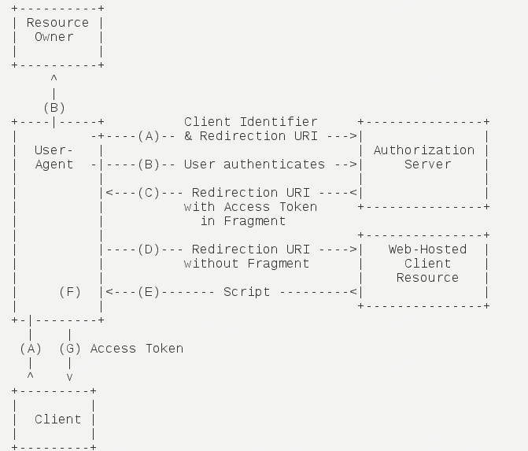
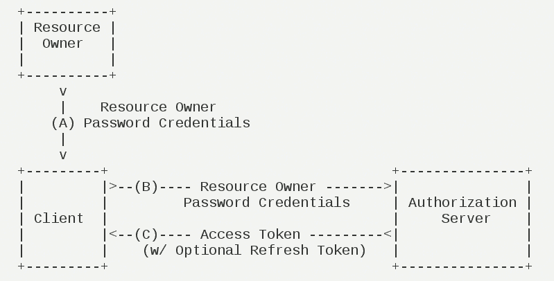
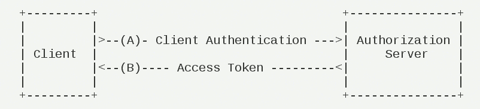

```
 OAuth在"客户端"与"服务提供商"之间，设置了一个授权层（authorization layer）。"客户端"不能直接登录"服务提供商"，只能登录授权层，以此将用户与客户端区分开来。"客户端"登录授权层所用的令牌（token），与用户的密码不同。用户可以在登录的时候，指定授权层令牌的权限范围和有效期。

"客户端"登录授权层以后，"服务提供商"根据令牌的权限范围和有效期，向"客户端"开放用户储存的资料。

```

# OAuth 2.0的运行流程：



```
（A）用户打开客户端以后，客户端要求用户给予授权。

（B）用户同意给予客户端授权。

（C）客户端使用上一步获得的授权，向认证服务器申请令牌。

（D）认证服务器对客户端进行认证以后，确认无误，同意发放令牌。

（E）客户端使用令牌，向资源服务器申请获取资源。

（F）资源服务器确认令牌无误，同意向客户端开放资源。

```

五、客户端的授权模式 客户端必须得到用户的授权（authorization grant），才能获得令牌（access token）。

OAuth 2.0定义了四种授权方式：

- 授权码模式（authorization code）
- 简化模式（implicit）
- 密码模式（resource owner password credentials）
- 客户端模式（client credentials）

1、授权码模式

      授权码模式（authorization code）是功能最完整、流程最严密的授权模式。它的特点就是通过客户端的后台服务器，与"服务提供商"的认证服务器进行互动。



步骤如下：

（A）用户访问客户端，后者将前者导向认证服务器。

（B）用户选择是否给予客户端授权。

（C）假设用户给予授权，认证服务器将用户导向客户端事先指定的"重定向URI"（redirection URI），同时附上一个授权码。

（D）客户端收到授权码，附上早先的"重定向URI"，向认证服务器申请令牌。这一步是在客户端的后台的服务器上完成的，对用户不可见。

（E）认证服务器核对了授权码和重定向URI，确认无误后，向客户端发送访问令牌（access token）和更新令牌（refresh token）。

2、简化模式

     简化模式（implicit grant type）不通过第三方应用程序的服务器，直接在浏览器中向认证服务器申请令牌，跳过了"授权码"这个步骤，因此得名。所有步骤在浏览器中完成，令牌对访问者是可见的，且客户端不需要认证。



步骤如下：

（A）客户端将用户导向认证服务器。

（B）用户决定是否给于客户端授权。

（C）假设用户给予授权，认证服务器将用户导向客户端指定的"重定向URI"，并在URI的Hash部分包含了访问令牌。

（D）浏览器向资源服务器发出请求，其中不包括上一步收到的Hash值。

（E）资源服务器返回一个网页，其中包含的代码可以获取Hash值中的令牌。

（F）浏览器执行上一步获得的脚本，提取出令牌。

（G）浏览器将令牌发给客户端。

3、密码模式

     密码模式（Resource Owner Password Credentials Grant）中，用户向客户端提供自己的用户名和密码。客户端使用这些信息，向"服务商提供商"索要授权。

     在这种模式中，用户必须把自己的密码给客户端，但是客户端不得储存密码。这通常用在用户对客户端高度信任的情况下，比如客户端是操作系统的一部分，或者由一个著名公司出品。而认证服务器只有在其他授权模式无法执行的情况下，才能考虑使用这种模式。



步骤如下：

（A）用户向客户端提供用户名和密码。

（B）客户端将用户名和密码发给认证服务器，向后者请求令牌。

（C）认证服务器确认无误后，向客户端提供访问令牌。

4、客户端模式

     客户端模式（Client Credentials Grant）指客户端以自己的名义，而不是以用户的名义，向"服务提供商"进行认证。严格地说，客户端模式并不属于OAuth框架所要解决的问题。在这种模式中，用户直接向客户端注册，客户端以自己的名义要求"服务提供商"提供服务，其实不存在授权问题。



步骤如下：

（A）客户端向认证服务器进行身份认证，并要求一个访问令牌。

（B）认证服务器确认无误后，向客户端提供访问令牌。

六、更新令牌 如果用户访问的时候，客户端的"访问令牌"已经过期，则需要使用"更新令牌"申请一个新的访问令牌。

客户端发出更新令牌的HTTP请求，包含以下参数：

granttype：表示使用的授权模式，此处的值固定为"refreshtoken"，必选项。 refresh_token：表示早前收到的更新令牌，必选项。
scope：表示申请的授权范围，不可以超出上一次申请的范围，如果省略该参数，则表示与上一次一致。 ————————————————
