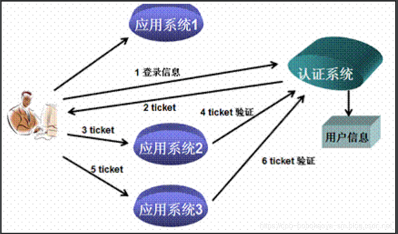

### https://mp.weixin.qq.com/s/9nRyVD2XkOkQHPr8kuE8UA

### 一、什么是单点登陆

单点登录（Single Sign On），简称为 SSO，是目前比较流行的企业业务整合的解决方案之一。SSO的定义是在多个应用系统中，用户只需要登录一次就可以访问所有相互信任的应用系统

### 二、简单的运行机制

单点登录的机制其实是比较简单的，用一个现实中的例子做比较。某公园内部有许多独立的景点，游客可以在各个景点门口单独买票。

对于需要游玩所有的景点的游客，这种买票方式很不方便，需要在每个景点门口排队买票，钱包拿 进拿出的，容易丢失，很不安全。

于是绝大多数游客选择在大门口买一张通票（也叫套票），就可以玩遍所有的景点而不需要重新再买票。他们只需要在每个景点门 口出示一下刚才买的套票就能够被允许进入每个独立的景点。

### 单点登录的机制也一样，如下图所示，

### jwt概念说明

从分布式认证流程中，我们不难发现，这中间起最关键作用的就是token，token的安全与否，直接关系到系统的健壮性，这里我们选择使用JWT来实现token的生成和校验。

JWT，全称JSON Web Token，官网地址https://jwt.io，是一款出色的分布式身份校验方案。可以生成token，也可以解析检验token。

### JWT生成的token由三部分组成：

头部：主要设置一些规范信息，签名部分的编码格式就在头部中声明。 载荷：token中存放有效信息的部分，比如用户名，用户角色，过期时间等，但是不要放密码，会泄露！
签名：将头部与载荷分别采用base64编码后，用“.”相连，再加入盐，最后使用头部声明的编码类型进行编码，就得到了签名。

### JWT生成token的安全性分析

从JWT生成的token组成上来看，要想避免token被伪造，主要就得看签名部分了，而签名部分又有三部分组成，其中头部和载荷的base64编码，几乎是透明的，毫无安全性可言，那么最终守护token安全的重担就落在了加入的盐上面了！

试想：如果生成token所用的盐与解析token时加入的盐是一样的。岂不是类似于中国人民银行把人民币防伪技术公开了？大家可以用这个盐来解析token，就能用来伪造token。这时，我们就需要对盐采用非对称加密的方式进行加密，以达到生成token与校验token方所用的盐不一致的安全效果！

### 非对称加密RSA介绍

基本原理: 同时生成两把密钥：私钥和公钥，私钥隐秘保存,公钥可以下发给信任客户端

私钥加密，持有公钥才可以解密 公钥加密，持有私钥才可解密 优点： 安全，难以破解

缺点： 算法比较耗时，为了安全，可以接受

历史： 三位数学家Rivest、Shamir 和 Adleman 设计了一种算法，可以实现非对称加密。这种算法用他们三个人的名字缩写：RSA

### SpringSecurity整合JWT

1.认证思路分析 SpringSecurity主要是通过过滤器来实现功能的！我们要找到SpringSecurity实现认证和校验身份的过滤器！

#### 回顾集中式认证流程

用户认证：使用UsernamePasswordAuthenticationFilter过滤器中attemptAuthentication方法实现认证功能，该过滤器父类中successfulAuthentication方法实现认证成功后的操作。

身份校验：使用BasicAuthenticationFilter过滤器中doFilterInternal方法验证是否登录，以决定能否进入后续过滤器。

#### 分析分布式认证流程

#### 用户认证：

由于分布式项目，多数是前后端分离的架构设计，我们要满足可以接受异步post的认证请求参数，需要修改UsernamePasswordAuthenticationFilter过滤器中attemptAuthentication方法，让其能够接收请求体。

另外，默认successfulAuthentication方法在认证通过后，是把用户信息直接放入session就完事了，现在我们需要修改这个方法，在认证通过后生成token并返回给用户。

#### 身份校验：

原来BasicAuthenticationFilter过滤器中doFilterInternal方法校验用户是否登录，就是看session中是否有用户信息，我们要修改为，验证用户携带的token是否合法，并解析出用户信息，交给SpringSecurity，以便于后续的授权功能可以正常使用。